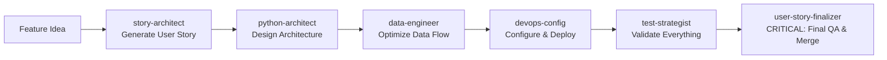

# Project Subagents

This directory contains specialized subagents for this project. Each subagent has specific expertise and responsibilities to support different aspects of development.

## Available Subagents

### 🟣 user-story-finalizer
- **File**: `.claude/agents/user-story-finalizer.md`
- **Model**: Inherit (Color: Purple)
- **Purpose**: Complete finalization workflow for user story implementations including validation, testing, linting, documentation updates, and git operations
- **Core Expertise**:
  - Comprehensive quality validation (mypy, black, ruff, isort)
  - Test execution and debugging with pytest
  - Automated issue fixing and remediation
  - Documentation maintenance and updates
  - Git workflow management (commit, push, prepare for merge)
  - Production readiness verification
  - Zero-tolerance quality enforcement

- **When to use**:
  - After completing any user story implementation
  - Before merging feature branches to main
  - When finalizing any significant code changes
  - To ensure all quality gates are passed
  - For automated end-to-end validation workflow
  - **CRITICAL**: Always use after declaring a feature complete

### 🔴 python-architect
- **File**: `.claude/agents/python-architect.md`
- **Model**: Sonnet (Color: Red)
- **Purpose**: Expert guidance on Python architecture, class design, Pydantic models, type safety, and code structure improvements
- **Core Expertise**:
  - Python 3.9+ language features (pattern matching, union types, modern typing)
  - Pydantic v2 architecture (validators, serializers, computed fields, model configuration)
  - SOLID principles applied to Python
  - Performance profiling and optimization
  - Type system design with mypy and pyright
  - Modern Python packaging with uv

- **When to use**:
  - Designing new components or reviewing existing architecture
  - Creating or optimizing Pydantic models with comprehensive validation
  - Improving type hints and ensuring type safety
  - Refactoring code for better structure and maintainability
  - Performance optimization at the code level
  - Ensuring adherence to modern Python best practices

### 🔵 data-engineer
- **File**: `.claude/agents/data-engineer.md`
- **Model**: Sonnet (Color: Blue)
- **Purpose**: Expertise in database optimization, ETL patterns, and high-performance data transfer strategies
- **Core Expertise**:
  - Data transfer optimization between different data sources
  - Database performance tuning (connection pools, query optimization, bulk loading)
  - Schema mapping and conversion strategies
  - Reliability engineering (retry mechanisms, circuit breakers, error handling)
  - Performance monitoring and metrics
  - Optimization level selection and strategy

- **When to use**:
  - Optimizing data transfer between different systems
  - Designing ETL pipelines and data transformations
  - Handling schema conversions and mappings
  - Implementing retry mechanisms and error recovery
  - Performance tuning for large datasets (>1GB)
  - Selecting appropriate optimization strategies
  - **Proactive Use**: Automatically invoked for database-related operations

### 🟡 test-strategist
- **File**: `.claude/agents/test-strategist.md`
- **Model**: Opus (Color: Yellow)
- **Purpose**: Comprehensive test design, edge case identification, and quality assurance with 90%+ coverage target
- **Core Expertise**:
  - Comprehensive test suite design following testing pyramid principles
  - Edge case and error scenario identification
  - Integration test creation for complete workflows
  - Performance validation and benchmarking
  - Test fixture and utility design
  - pytest expertise with parameterization and mocking
  - Coverage analysis and gap identification

- **When to use**:
  - Creating comprehensive test suites for new features
  - Improving test coverage for existing code
  - Debugging failing tests in CI/CD pipelines
  - Designing test fixtures and parametrization strategies
  - Identifying missing test scenarios and edge cases
  - Validating performance characteristics
  - **Proactive Use**: Automatically invoked after implementing new features

### 🟢 devops-config
- **File**: `.claude/agents/devops-config.md`
- **Model**: Sonnet (Color: Green)
- **Tools**: Read, Edit, Bash, Grep, Glob
- **Purpose**: DevOps and configuration expert for production-ready systems, CLI design, and user experience
- **Core Expertise**:
  - YAML configuration design with Pydantic validation
  - CLI/UX design with Click and Rich formatting
  - Error handling and user-friendly messaging
  - Production deployment and reliability
  - Comprehensive logging with Loguru
  - Documentation and user guides
  - Monitoring and observability

- **When to use**:
  - Designing CLI interfaces and commands
  - Improving configuration management and validation
  - Enhancing error handling and user experience
  - Setting up CI/CD pipelines
  - Production deployment considerations
  - Creating user-focused documentation
  - **Proactive Use**: Automatically invoked for configuration and CLI tasks

### 🟠 story-architect
- **File**: `.claude/agents/story-architect.md`
- **Model**: Opus (Color: Orange)
- **Tools**: Read, Glob, Grep, Write, Task
- **Purpose**: Requirements analyst and user story generator that transforms feature ideas into implementation-ready user stories
- **Core Expertise**:
  - Natural language processing for feature descriptions
  - Codebase analysis and context understanding
  - Requirements engineering and technical writing
  - Phase classification (1-6) and story ID assignment
  - Acceptance criteria generation (7-10 testable items)
  - Consultation with python-architect for architecture design
  - Consultation with test-strategist for test scenarios
  - 12-point quality validation checklist
  - Complete story template population (all 10 sections)

- **When to use**:
  - When you have a feature idea but no user story yet
  - To transform natural language descriptions into structured stories
  - To automatically classify features and assign appropriate phases
  - To generate comprehensive acceptance criteria and test cases
  - To ensure consistent story format and quality
  - Before running `/implement-user-story` when story doesn't exist
  - **Proactive Use**: Invoked by `/define-user-story` command

## Usage Examples

### Explicit Invocation
Subagents can be invoked explicitly in Claude Code:

```bash
# User Story Finalizer (CRITICAL - Use after completing features)
"I've finished implementing the performance monitoring user story"
"The batch processing feature is complete, please finalize it"
"Finalize and prepare US-4.2 for merge to main"

# Story Architect (Generate User Stories)
"Generate a user story for adding query result caching"
"Create a story for implementing connection pooling with configurable pool size"
"I need a story for adding Delta Lake time travel support"

# Python Architecture
"Review the DataProcessor class architecture and suggest improvements"
"Help me design Pydantic models for the processing engine with proper validation"
"Add comprehensive type hints to the processor module"

# Data Engineering
"Optimize the bulk loading strategy for transferring large datasets"
"Design schema mapping between different data sources"
"Design an incremental data processing strategy for daily updates"

# Test Strategy
"Create comprehensive tests for the new batch processing function"
"The integration tests are failing in the CI pipeline"
"Our configuration module only has 60% test coverage"

# DevOps & Configuration
"Design a user-friendly CLI interface for the application"
"Improve the YAML configuration validation and error messages"
"Set up production-ready logging and monitoring"
```

### Automatic Delegation
Claude Code will automatically delegate tasks to appropriate subagents based on context:
- **Story definition** → story-architect (via `/define-user-story` command)
- **Feature completion** → user-story-finalizer (CRITICAL - always invoked)
- **Database operations** → data-engineer
- **New feature implementation** → test-strategist (for tests)
- **Configuration changes** → devops-config
- **Class/model design** → python-architect

### Proactive Invocation
Certain agents are invoked proactively:
- **story-architect**: By `/define-user-story` command for story generation
- **user-story-finalizer**: ALWAYS after feature completion is declared
- **data-engineer**: When database operations are detected
- **test-strategist**: After implementing new features
- **devops-config**: For configuration and CLI tasks

## Agent Characteristics

| Agent | Model | Color | Tools | Proactive |
|-------|-------|-------|-------|-----------|
| story-architect | Opus | 🟠 Orange | Read, Glob, Grep, Write, Task | Yes |
| user-story-finalizer | Inherit | 🟣 Purple | Default | Yes (CRITICAL) |
| python-architect | Sonnet | 🔴 Red | Default | No |
| data-engineer | Sonnet | 🔵 Blue | Default | Yes |
| test-strategist | Opus | 🟡 Yellow | Default | Yes |
| devops-config | Sonnet | 🟢 Green | Read, Edit, Bash, Grep, Glob | Yes |

## Best Practices

### When to Use Each Agent

1. **Use story-architect** when:
   - You have a feature idea but no user story document yet
   - You want to transform a natural language description into a structured story
   - You need comprehensive acceptance criteria and test cases generated
   - You want automatic phase classification and story ID assignment
   - Via `/define-user-story` command

2. **ALWAYS use user-story-finalizer** when:
   - Declaring any feature or user story complete
   - Before merging any branch to main
   - After implementing significant changes
   - To ensure production readiness
   - **This is CRITICAL and NON-NEGOTIABLE**

3. **Start with python-architect** when:
   - Beginning a new feature to design the architecture
   - Refactoring existing code for better structure
   - Optimizing performance at the code level

4. **Consult data-engineer** for:
   - Any Databricks or DuckDB specific operations
   - Performance issues with data transfer
   - Schema mapping challenges

5. **Engage test-strategist** to:
   - Ensure comprehensive test coverage
   - Debug complex test failures
   - Design test strategies for new features

6. **Use devops-config** for:
   - User-facing interfaces (CLI, configuration)
   - Production deployment planning
   - Error handling and user experience

### Collaboration Between Agents

Agents can be used sequentially for comprehensive solutions:



## Management

Use the `/agents` command in Claude Code to:
- View all available subagents with their configurations
- Create new project-specific subagents
- Edit existing subagent definitions
- Manage tool permissions and capabilities
- Check agent invocation history

## Technical Implementation

Each agent is defined with:
- **YAML frontmatter**: Metadata including name, description, model, color, and tools
- **System prompt**: Detailed instructions about expertise, responsibilities, and approach
- **Examples**: Specific use cases with context and expected behavior
- **Guidelines**: Project-specific patterns and conventions to follow

These subagents are project-specific and designed to support the development workflow with specialized expertise.
