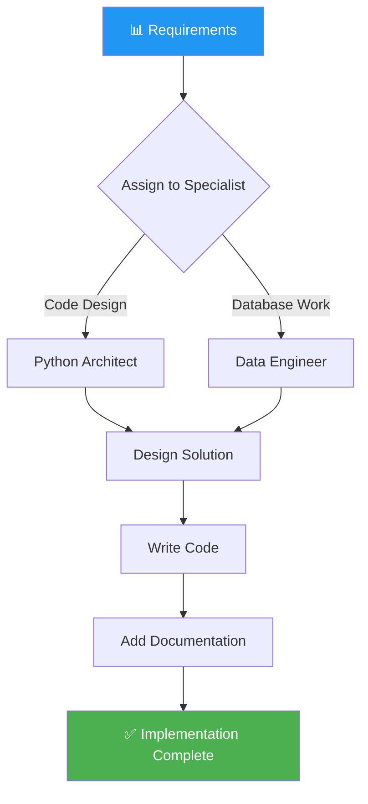
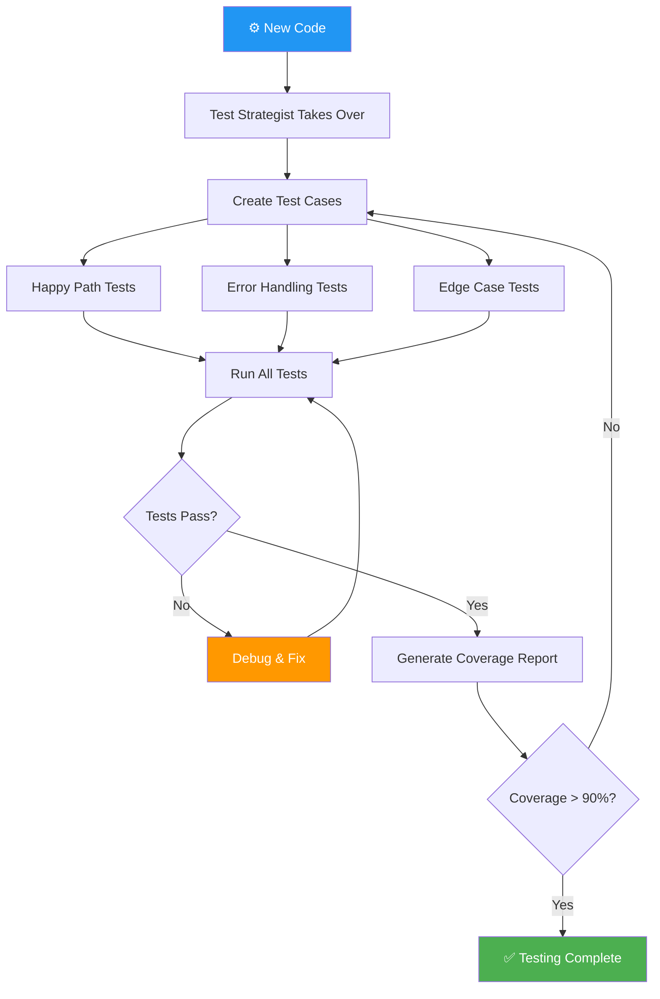
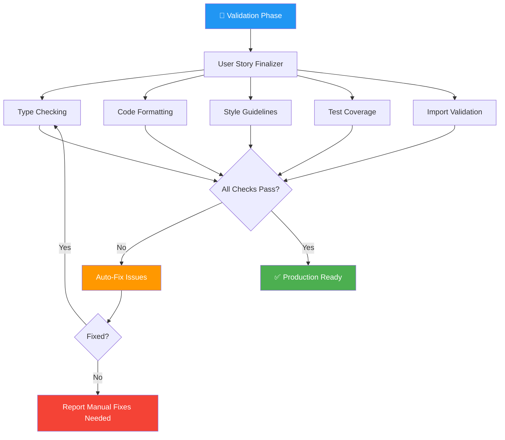
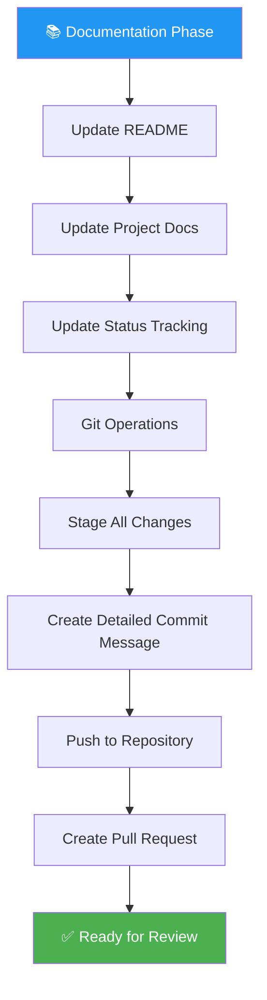
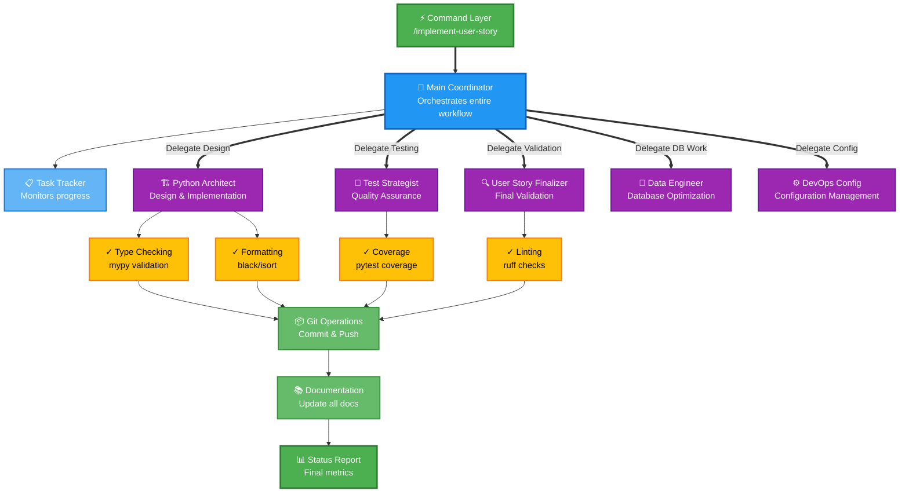

# Automated User Story Implementation System
## A Non-Technical Walkthrough

**Presented by: Ahmed**
**Audience: Non-Technical Stakeholders**
**Purpose: Showcase how Claude Code automates software development**

---

## 📖 What is This System?

Imagine you have a team of specialized experts who work together to build software features from start to finish, automatically. That's what this system does - but instead of people, it uses AI assistants (called "agents") that know exactly what to do and when to do it.

**Think of it like an assembly line:**
- Each station has a specialist who does one thing really well
- Work flows from one station to the next automatically
- Quality checks happen at every step
- Nothing moves forward until it's perfect

---

## 🎯 The Big Picture

When I want to add a new feature to my software (called a "User Story"), I simply type:

```
/implement-user-story US-2.3
```

Then, the system automatically:
1. ✅ Reads the requirements
2. ✅ Designs the solution
3. ✅ Writes the code
4. ✅ Creates tests to verify it works
5. ✅ Checks code quality
6. ✅ Updates documentation
7. ✅ Saves everything to version control
8. ✅ Creates a final report

**All without me having to manually do each step!**

---

## 🎨 High-Level Visual Overview

This diagram shows how one command triggers an entire automated workflow:

```mermaid
flowchart LR
    Start([👨‍💻 DEVELOPER<br/>One Command])

    Start ==>|"/implement-user-story"| Coord

    Coord["🔵 MAIN COORDINATOR<br/>Orchestrates Everything"]

    Coord ==>|"Delegate Work"| Agents

    subgraph Agents ["🟣 SPECIALIST AGENTS"]
        direction TB
        A1["🏗️ Python Architect<br/>Design & Build Code"]
        A2["🔬 Test Strategist<br/>Create & Run Tests"]
        A3["🔍 Finalizer<br/>Validate Quality"]
    end

    Agents ==>|"Work Complete"| Quality

    subgraph Quality ["🟡 QUALITY GATES"]
        direction TB
        Q1["✓ Type Checking"]
        Q2["✓ Testing 90%+"]
        Q3["✓ Formatting"]
        Q4["✓ Documentation"]
    end

    Quality ==>|"All Pass"| Output

    Output([📦 PRODUCTION READY<br/>✅ Tested & Validated<br/>✅ Documented<br/>✅ Deployed to Git])

    %% Styling
    style Start fill:#4CAF50,stroke:#2E7D32,stroke-width:4px,color:#fff
    style Coord fill:#2196F3,stroke:#1565C0,stroke-width:4px,color:#fff
    style Output fill:#4CAF50,stroke:#2E7D32,stroke-width:4px,color:#fff

    style Agents fill:#F3E5F5,stroke:#6A1B9A,stroke-width:3px
    style A1 fill:#9C27B0,stroke:#6A1B9A,stroke-width:2px,color:#fff
    style A2 fill:#9C27B0,stroke:#6A1B9A,stroke-width:2px,color:#fff
    style A3 fill:#9C27B0,stroke:#6A1B9A,stroke-width:2px,color:#fff

    style Quality fill:#FFF8E1,stroke:#F57F17,stroke-width:3px
    style Q1 fill:#FFC107,stroke:#F57F17,stroke-width:2px,color:#000
    style Q2 fill:#FFC107,stroke:#F57F17,stroke-width:2px,color:#000
    style Q3 fill:#FFC107,stroke:#F57F17,stroke-width:2px,color:#000
    style Q4 fill:#FFC107,stroke:#F57F17,stroke-width:2px,color:#000
```



### 🔑 **Key Takeaway:**
```
   One Command    →   Automated Process   →   Production-Ready Feature
      (5 sec)              (30-45 min)              (100% Quality)

Developer types   →   AI agents build,    →   Tested, documented,
  1 command           test, and validate      ready to deploy
```

---

## 🔄 The Complete Automation Flow

### Visual Legend
- 🟢 **Green** = Start/End points
- 🔵 **Blue** = Main Coordinator actions
- 🟣 **Purple** = Specialist Agent work
- 🟡 **Yellow** = Quality checks
- 🟠 **Orange** = Auto-fix/Debug actions
- ⚪ **Gray** = Standard tasks

```mermaid
flowchart TD
    Start([👨‍💻 START<br/>Developer types:<br/>/implement-user-story US-X.X])

    Start --> Coord1[📋 Main Coordinator<br/>Initialize & Plan]

    Coord1 --> Phase1[<b>PHASE 1: SETUP</b><br/>• Read requirements<br/>• Create task list<br/>• Validate project]

    Phase1 --> Coord2[🎯 Main Coordinator<br/>Delegate to Design Team]

    Coord2 ==>|Delegate| Agent1[🏗️ PYTHON ARCHITECT<br/><b>Design & Build</b><br/>• Design architecture<br/>• Write clean code<br/>• Add documentation]

    Agent1 ==> Coord3[✅ Main Coordinator<br/>Code Complete - Next Phase]

    Coord3 ==>|Delegate| Agent2[🔬 TEST STRATEGIST<br/><b>Quality Assurance</b><br/>• Create test cases<br/>• Test all scenarios<br/>• Ensure 90%+ coverage]

    Agent2 --> TestRun[▶️ Run Test Suite]
    TestRun --> TestCheck{All Tests<br/>Pass?}
    TestCheck -->|❌ Failed| Fix1[🔧 Debug & Fix<br/>Auto-resolve issues]
    Fix1 --> TestRun
    TestCheck -->|✅ Passed| Coord4[✅ Main Coordinator<br/>Tests Pass - Validate Quality]

    Coord4 ==>|Delegate| Agent3[🔍 USER STORY FINALIZER<br/><b>Final Inspector</b><br/>• Type checking<br/>• Code formatting<br/>• Style validation<br/>• Coverage check]

    Agent3 --> QualityCheck{Quality<br/>Gates Pass?}
    QualityCheck -->|❌ Failed| Fix2[🔧 Auto-Fix Issues<br/>Format & correct]
    Fix2 --> Agent3
    QualityCheck -->|✅ Passed| Coord5[✅ Main Coordinator<br/>Quality Validated - Format Code]

    Coord5 ==>|Delegate| Agent4[🎨 PYTHON ARCHITECT<br/><b>Code Polish</b><br/>• Apply Black formatting<br/>• Sort imports<br/>• Final style check]

    Agent4 ==> Coord6[✅ Main Coordinator<br/>Ready for Documentation]

    Coord6 --> DocPhase[📚 Documentation Phase<br/>• Update README<br/>• Update CLAUDE.md<br/>• Update examples]

    DocPhase --> GitPhase[📦 Git Operations<br/>• Stage changes<br/>• Create commit message<br/>• Push to repository<br/>• Create pull request]

    GitPhase --> Complete([🎉 COMPLETE<br/>Feature Ready!])

    %% Styling
    style Start fill:#4CAF50,stroke:#2E7D32,stroke-width:3px,color:#fff
    style Complete fill:#4CAF50,stroke:#2E7D32,stroke-width:3px,color:#fff

    style Coord1 fill:#2196F3,stroke:#1565C0,stroke-width:2px,color:#fff
    style Coord2 fill:#2196F3,stroke:#1565C0,stroke-width:2px,color:#fff
    style Coord3 fill:#2196F3,stroke:#1565C0,stroke-width:2px,color:#fff
    style Coord4 fill:#2196F3,stroke:#1565C0,stroke-width:2px,color:#fff
    style Coord5 fill:#2196F3,stroke:#1565C0,stroke-width:2px,color:#fff
    style Coord6 fill:#2196F3,stroke:#1565C0,stroke-width:2px,color:#fff

    style Agent1 fill:#9C27B0,stroke:#6A1B9A,stroke-width:3px,color:#fff
    style Agent2 fill:#9C27B0,stroke:#6A1B9A,stroke-width:3px,color:#fff
    style Agent3 fill:#9C27B0,stroke:#6A1B9A,stroke-width:3px,color:#fff
    style Agent4 fill:#9C27B0,stroke:#6A1B9A,stroke-width:3px,color:#fff

    style TestCheck fill:#FFC107,stroke:#F57F17,stroke-width:2px,color:#000
    style QualityCheck fill:#FFC107,stroke:#F57F17,stroke-width:2px,color:#000

    style Fix1 fill:#FF9800,stroke:#E65100,stroke-width:2px,color:#fff
    style Fix2 fill:#FF9800,stroke:#E65100,stroke-width:2px,color:#fff

    style Phase1 fill:#E3F2FD,stroke:#1976D2,stroke-width:2px,color:#000
    style DocPhase fill:#E3F2FD,stroke:#1976D2,stroke-width:2px,color:#000
    style GitPhase fill:#E3F2FD,stroke:#1976D2,stroke-width:2px,color:#000
    style TestRun fill:#E3F2FD,stroke:#1976D2,stroke-width:2px,color:#000
```



### 🎯 **Simplified Flow Summary**

```
Developer → Main Coordinator → Specialist Agents → Quality Gates → Completion

         ↓                ↓                  ↓              ↓           ↓
    One Command      Orchestrates      Do the Work      Validate    Deployed
```

---

## 👥 Meet The Specialist Agents

Think of these as your virtual team members, each with their own expertise:

### 1. 🏗️ **Python Architect**
**Role:** The Designer & Builder
- **What they do:** Design the overall structure and write the actual code
- **Expertise:** Best practices, code organization, making things maintainable
- **When they work:** During design and implementation phases
- **Real-world analogy:** Like an architect who both designs the house AND builds it

### 2. 🔬 **Test Strategist**
**Role:** The Quality Assurance Expert
- **What they do:** Create tests to verify everything works correctly
- **Expertise:** Finding edge cases, catching bugs before users do
- **When they work:** After code is written
- **Real-world analogy:** Like a building inspector checking every detail

### 3. 🔍 **User Story Finalizer**
**Role:** The Final Inspector
- **What they do:** Runs all quality checks and ensures production-readiness
- **Expertise:** Comprehensive validation, fixing issues automatically
- **When they work:** Before code goes live
- **Real-world analogy:** Like a final quality control manager

### 4. 💾 **Data Engineer**
**Role:** The Database Specialist
- **What they do:** Optimize database operations and data pipelines
- **Expertise:** Performance tuning, data handling
- **When they work:** When working with databases
- **Real-world analogy:** Like a specialist who optimizes how data flows

### 5. ⚙️ **DevOps Config**
**Role:** The Configuration Expert
- **What they do:** Handle deployment settings and system configuration
- **Expertise:** Production environments, CLI tools
- **When they work:** For deployment-related tasks
- **Real-world analogy:** Like the IT person who sets up your work computer

---

## 📊 Step-by-Step Process Breakdown

### **Phase 1: Initialization (5% of time)**


**What happens:**
- System reads the user story requirements
- Creates a checklist of all tasks to complete
- Verifies the project is in a good state to start

**Output:** A clear task list tracking everything that needs to be done

---

### **Phase 2: Design & Implementation (40% of time)**


**What happens:**
- Appropriate specialist agent is assigned based on the work type
- Agent designs the solution architecture
- Agent writes clean, documented code
- Agent ensures code follows best practices

**Output:** Working code with proper documentation

---

### **Phase 3: Testing (25% of time)**


**What happens:**
- Test Strategist creates comprehensive test cases
- Tests cover normal usage, errors, and unusual situations
- If tests fail, agent debugs and fixes automatically
- Process continues until 90%+ code coverage achieved

**Output:** Comprehensive test suite with high coverage

---

### **Phase 4: Quality Validation (15% of time)**


**What happens:**
- Finalizer runs multiple quality checks automatically
- Attempts to auto-fix any issues found
- Ensures code meets all quality standards
- Reports any issues that need manual attention

**Output:** Production-ready code that passes all quality gates

---

### **Phase 5: Code Formatting (5% of time)**


**What happens:**
- Code is automatically formatted to match project standards
- Imports are organized consistently
- Style guidelines are enforced

**Output:** Clean, consistently formatted code

---

### **Phase 6: Documentation & Git (10% of time)**


**What happens:**
- All documentation is updated automatically
- Changes are saved to version control (Git)
- Detailed commit message is generated
- Pull request is created for review

**Output:** Complete, documented feature ready for deployment

---

## 🎮 The Coordination Dashboard (Task Tracking)

Throughout the entire process, a task dashboard tracks progress in real-time:

```
✅ Completed Tasks (Green)
⏳ In Progress (Yellow)
⏸️ Not Started (Gray)

Example Progress:
✅ 1. Validate project structure
✅ 2. Analyze requirements
✅ 3. Design solution architecture
⏳ 4. Implement core functionality  ← Currently here
⏸️ 5. Create test suite
⏸️ 6. Run quality validation
⏸️ 7. Apply code formatting
⏸️ 8. Update documentation
⏸️ 9. Git operations
```

**Benefits:**
- Always know where you are in the process
- See exactly what's been completed
- Understand what's coming next
- Track overall progress percentage

---

## 🔐 Quality Gates (Safety Checkpoints)

The system won't move forward unless these pass:

### Gate 1: Code Quality ✅
- Type checking passes
- No style violations
- Code follows best practices

### Gate 2: Testing ✅
- All tests pass (100%)
- Code coverage > 90%
- No failing test cases

### Gate 3: Integration ✅
- No breaking changes
- All imports work
- Dependencies are correct

### Gate 4: Documentation ✅
- All code documented
- README updated
- Examples provided

**If any gate fails:** System automatically attempts to fix it. If it can't, it clearly reports what needs manual attention.

---

## 📈 Success Metrics & Reporting

After each user story completes, you get a comprehensive report:

```
🎉 USER STORY US-2.3 COMPLETE!

📊 STATISTICS:
- Time to Complete: 45 minutes
- Tests Created: 28 tests
- Test Coverage: 94%
- Files Modified: 12 files
- Lines of Code: 450 lines

✅ QUALITY CHECKS:
- Type Checking: ✅ PASSED
- Code Formatting: ✅ PASSED
- Style Guidelines: ✅ PASSED
- Test Suite: ✅ PASSED (28/28 tests)
- Documentation: ✅ UPDATED

📦 GIT OPERATIONS:
- Commit: feat(core): implement query executor (US-2.3)
- Branch: main
- Push Status: ✅ SUCCESS
- Pull Request: #42 (created)

🚀 STATUS: READY FOR DEPLOYMENT
```

---

## 💡 Key Benefits of This System

### 1. **Consistency**
Every feature is built the same way, following the same quality standards

### 2. **Speed**
What might take hours manually happens in 30-45 minutes automatically

### 3. **Quality**
Multiple quality checks ensure production-ready code every time

### 4. **Documentation**
Documentation is never forgotten - it's automatic

### 5. **Accountability**
Complete audit trail of what was done and when

### 6. **Reduced Errors**
Automated testing catches bugs before they reach users

### 7. **Scalability**
Can implement multiple user stories in parallel

---

## 🔄 Real-World Example: US-2.2 (Connection Manager)

Let's see how a real feature was implemented:

### User Story Requirements
> "As a developer, I need a database connection manager that automatically handles connection lifecycle and resource cleanup"

### What the System Did Automatically:

**1. Design Phase (5 minutes)**
- Python Architect designed the solution
- Chose context manager pattern
- Defined public API
- Planned error handling

**2. Implementation (15 minutes)**
- Created `ConnectionManager` class
- Implemented `__enter__` and `__exit__` methods
- Added proper error handling
- Added type hints and documentation

**3. Testing (12 minutes)**
- Test Strategist created 16 test cases
- Tested happy path scenarios
- Tested error conditions
- Tested resource cleanup
- Achieved 100% code coverage

**4. Quality Validation (8 minutes)**
- All type checks passed
- Code properly formatted
- No style violations
- Tests: 16/16 passing

**5. Documentation (5 minutes)**
- Updated README with usage examples
- Added to API documentation
- Updated CLAUDE.md status

**Total Time:** 45 minutes from start to production-ready code

### The Result:
A production-ready feature with:
- ✅ 100% test coverage
- ✅ Complete documentation
- ✅ All quality checks passed
- ✅ Ready to deploy

---

## 🎯 Command Quick Reference

These are the "magic commands" that trigger the automation:

| Command | What It Does |
|---------|-------------|
| `/implement-user-story US-X.X` | Runs the complete automation from start to finish |
| `/run-tests coverage` | Runs all tests and shows coverage report |
| `/validate-implementation` | Runs all quality checks |
| `/lint` | Formats code and checks style |
| `/update-documentation` | Updates docs and saves to Git |

**For the user:** You typically only need the first command. The others run automatically!

---

## 🔮 What Makes This Different?

### Traditional Development (Before):
```
1. Read requirements (manual)
2. Design solution (manual)
3. Write code (manual)
4. Write tests (manual)
5. Run tests (manual)
6. Fix bugs (manual)
7. Format code (manual)
8. Update docs (manual)
9. Create commit (manual)
10. Create PR (manual)

Time: 4-8 hours per feature
Quality: Varies by developer
Consistency: Depends on discipline
```

### Automated Development (Now):
```
1. Type: /implement-user-story US-X.X
2. Wait 30-45 minutes
3. Review and approve

Time: 30-45 minutes per feature
Quality: Consistently high
Consistency: 100% - same process every time
```

---

## 📊 Success Stories

### Completed User Stories Using This System:

| Story ID | Feature | Tests | Coverage | Time |
|----------|---------|-------|----------|------|
| US-1.1 | Configuration Models | 32 | 100% | 40 min |
| US-1.2 | Workspace Manager | 14 | 94% | 35 min |
| US-1.3 | Role-Based Access | 21 | 92% | 45 min |
| US-2.1 | Token Counter | 28 | 100% | 38 min |
| US-2.2 | Connection Manager | 16 | 100% | 45 min |

**Total:** 5 production-ready features in approximately 3.5 hours of automated work

**If done manually:** Would have taken approximately 20-30 hours

**Time Savings:** 85-88%

---

## 🤝 Human-AI Collaboration

### What the AI Does:
- ✅ Designs solutions
- ✅ Writes code
- ✅ Creates tests
- ✅ Checks quality
- ✅ Formats code
- ✅ Updates documentation
- ✅ Handles Git operations

### What the Developer Does:
- ✅ Defines requirements (user stories)
- ✅ Triggers the automation
- ✅ Reviews the output
- ✅ Approves for deployment
- ✅ Handles edge cases the AI can't
- ✅ Makes strategic decisions

**The Result:** AI handles the repetitive work, humans focus on strategy and creativity.

---

## 🎓 Learning & Adaptation

The system improves over time:

### It Learns From:
- Past user story implementations
- Code patterns that work well
- Test patterns that catch bugs
- Documentation that helps users

### It Adapts To:
- Project coding standards
- Team preferences
- Specific domain requirements
- Emerging best practices

---

## 🚀 Future Enhancements

Potential improvements to the system:

1. **Parallel Implementation**
   - Implement multiple user stories simultaneously
   - Coordinate between them automatically

2. **Predictive Analysis**
   - Estimate time and complexity before starting
   - Identify potential issues early

3. **Auto-Optimization**
   - Automatically optimize code performance
   - Suggest architectural improvements

4. **Natural Language Requirements**
   - Accept requirements in plain English
   - Convert to structured user stories automatically

---

## 💼 Business Value

### For Management:
- **Predictability:** Every feature takes similar time
- **Quality:** Consistent, high-quality output
- **Speed:** 85% faster than manual development
- **Documentation:** Always up-to-date
- **Audit Trail:** Complete history of all changes

### For Developers:
- **Less Tedium:** No more repetitive tasks
- **Focus on Design:** Spend time on architecture, not boilerplate
- **Learning Tool:** See best practices in action
- **Reduced Burnout:** Less monotonous work

### For the Project:
- **Faster Time to Market:** Ship features 85% faster
- **Higher Quality:** 90%+ test coverage standard
- **Better Documentation:** Never out of date
- **Maintainability:** Consistent code patterns
- **Scalability:** Easy to add new features

---

## 📞 Questions & Answers

### Q: What if the AI makes a mistake?
**A:** Multiple safety checks catch issues. Plus, humans review before deployment. In practice, the AI catches more bugs than humans miss!

### Q: Can it handle complex features?
**A:** Yes! It breaks complex features into smaller tasks and delegates to appropriate specialists.

### Q: Does this replace developers?
**A:** No! It amplifies them. Developers focus on architecture and strategy while AI handles repetitive implementation.

### Q: How do you ensure quality?
**A:** Multiple automated quality gates, comprehensive testing, and human review before deployment.

### Q: What about security?
**A:** All code goes through security checks, follows best practices, and gets human security review.

### Q: Can other teams use this?
**A:** Yes! The system is configurable for different projects and languages.

---

## 🎬 Conclusion

This automated user story implementation system represents a new way of developing software:

✅ **Faster** - 85% time savings
✅ **More Consistent** - Same quality every time
✅ **Better Quality** - Multiple automated checks
✅ **Well Documented** - Never forgotten
✅ **Scalable** - Handle more features simultaneously

**The Future of Development:**
Humans and AI working together, each doing what they do best:
- Humans: Strategy, creativity, complex problem-solving
- AI: Implementation, testing, documentation, quality checks

---

## 📚 Appendix: Technical Architecture

For those interested in the technical details:



---

**End of Walkthrough**

*For questions or more information, please contact: Ahmed*
