# User Story Creation Guide

This guide explains how to create implementation-ready user stories using the `/define-user-story` command.

## Quick Start

### Basic Usage

```bash
/define-user-story "Add query result caching to improve performance"
```

That's it! The system will automatically:
1. Analyze your feature description
2. Generate a comprehensive user story
3. Assign appropriate phase and story ID
4. Create all required sections
5. Validate quality
6. Save to `user_stories/` directory

### Complete Workflow

```mermaid
graph LR
    IDEA([💡 Feature Idea]) --> CMD["/define-user-story"]
    CMD --> GEN[🟠 Story Architect<br/>Generates Story]
    GEN --> REVIEW{'📖 Review'}
    REVIEW -->|✅ Approve| IMPL["/implement-user-story"]
    REVIEW -->|✏️ Refine| GEN
    IMPL --> PROD([🚀 Production])

    style IDEA fill:#4CAF50,color:#fff
    style CMD fill:#2196F3,color:#fff
    style GEN fill:#FF9800,color:#fff
    style PROD fill:#4CAF50,color:#fff
```



---

## Writing Good Feature Descriptions

### What Makes a Good Description?

A good feature description is:
- **Specific** - Clear about what needs to be built
- **Actionable** - Describes a concrete capability
- **Purposeful** - Explains why it's needed
- **Scoped** - Focused on one feature

### Good Examples

✅ **Specific and Clear:**
```
Add query result caching with configurable TTL and LRU eviction strategy
```

✅ **Actionable with Context:**
```
Implement connection pooling for database connections with configurable pool size (default 10 connections)
```

✅ **Purpose-Driven:**
```
Add support for Delta Lake time travel queries to enable point-in-time analysis
```

✅ **Well-Scoped:**
```
Create export functionality for table data in CSV, JSON, and Parquet formats
```

### Bad Examples

❌ **Too Vague:**
```
Make it faster
```
*Problem*: What specifically should be faster?

❌ **Too Broad:**
```
Add all Delta Lake features
```
*Problem*: This should be multiple user stories

❌ **No Purpose:**
```
Add a service
```
*Problem*: What kind of service? What does it do?

❌ **Missing Context:**
```
Implement caching
```
*Problem*: Caching for what? How should it work?

---

## Feature Description Template

Use this template to structure your feature descriptions:

```
Add/Implement/Create {FEATURE} to {GOAL/PURPOSE}
[Optional: with {SPECIFIC_REQUIREMENTS}]
```

### Examples Using the Template

```
Add query result caching to improve performance for frequently accessed tables

Implement OAuth authentication to enable secure third-party integrations

Create export functionality to allow users to download data in multiple formats with configurable batch sizes

Add support for custom SQL functions to enable domain-specific computations
```

---

## The Story Generation Process

### What Happens When You Run /define-user-story

```mermaid
graph TD
    START["/define-user-story"] --> PARSE[1. Parse Feature Description]
    PARSE --> ANALYZE[2. Analyze Codebase]
    ANALYZE --> CLASSIFY[3. Classify & Assign ID]
    CLASSIFY --> STORY[4. Generate Story Statement]
    STORY --> CRITERIA[5. Create Acceptance Criteria]
    CRITERIA --> CONSULT1{6. Need Architecture<br/>Design?}
    CONSULT1 -->|Yes| PYARCH[Consult python-architect]
    CONSULT1 -->|No| CONSULT2
    PYARCH --> CONSULT2{7. Need Test<br/>Scenarios?}
    CONSULT2 -->|Yes| TESTSTR[Consult test-strategist]
    CONSULT2 -->|No| COMPLETE
    TESTSTR --> COMPLETE[8. Complete All Sections]
    COMPLETE --> VALIDATE[9. Validate Quality]
    VALIDATE --> SAVE[10. Save Story File]
    SAVE --> DONE([✅ Story Ready])

    style START fill:#2196F3,color:#fff
    style DONE fill:#4CAF50,color:#fff
    style PYARCH fill:#9C27B0,color:#fff
    style TESTSTR fill:#9C27B0,color:#fff
```



### Timeline

**Total Time**: 5-10 minutes for most features

- **Phase 1** (1-2 min): Parse and analyze
- **Phase 2** (2-3 min): Generate structure and criteria
- **Phase 3** (3-4 min): Consult experts and design
- **Phase 4** (1-2 min): Validate and save

---

## Understanding Story Phases

Every story is automatically classified into one of 6 phases:

### Phase 1: Foundation
**What**: Configuration, security, role management, foundational models
**When to Use**: Building core infrastructure and settings
**Examples**:
- Pydantic configuration models
- Workspace configuration manager
- Role-based access control

### Phase 2: Core Services
**What**: Core utilities, database connections, tokens, infrastructure
**When to Use**: Building fundamental services that other components depend on
**Examples**:
- Token counter utility
- Database connection manager
- Query executor service

### Phase 3: Business Services
**What**: Domain-specific business logic and services
**When to Use**: Building features specific to the problem domain
**Examples**:
- Catalog service
- Table service
- Function service

### Phase 4: Response & Chunking
**What**: Response formatting, token management, chunking logic
**When to Use**: Managing how responses are formatted and delivered
**Examples**:
- Chunking service
- Response manager
- Token optimization

### Phase 5: Integration
**What**: MCP tool integration, system refactoring, dependency injection
**When to Use**: Connecting components or refactoring existing code
**Examples**:
- Application container (DI)
- MCP tool refactoring
- Service integration

### Phase 6: Quality & Testing
**What**: Testing, type hints, linting, documentation, quality improvements
**When to Use**: Improving code quality, adding tests, enhancing docs
**Examples**:
- Integration test suites
- Type hint additions
- Pre-commit hooks
- Documentation improvements

### Phase Classification Examples

| Feature Description | → Phase | Reasoning |
|---------------------|---------|-----------|
| "Add Pydantic models for workspace config" | Phase 1 | Configuration/foundation |
| "Implement connection pooling" | Phase 2 | Core infrastructure |
| "Create export service for table data" | Phase 3 | Business logic |
| "Add response streaming for large results" | Phase 4 | Response handling |
| "Refactor MCP tools to use DI container" | Phase 5 | Integration/refactoring |
| "Add comprehensive type hints throughout" | Phase 6 | Quality improvement |

---

## What Gets Generated

### Complete Story Structure

Every generated story includes **10 comprehensive sections**:

#### 1. Metadata
- Story ID (auto-assigned: US-{phase}.{number})
- Descriptive title
- Phase classification
- LOC estimate
- Dependencies
- Status

#### 2. Overview
2-3 sentence high-level description of the feature.

#### 3. User Story
Standard "As a... I want... So that..." format identifying the user role, desired capability, and benefit.

#### 4. Acceptance Criteria
7-10 specific, testable requirements with checkboxes.

#### 5. Technical Requirements
Detailed implementation specs including:
- Classes/functions to create
- Data structures
- Integration approach
- Configuration needs

#### 6. Design Patterns
2-3 design patterns to use with justification.

#### 7. Implementation Notes
Best practices, security considerations, performance tips, potential gotchas.

#### 8. Files to Create/Modify
Specific file paths organized by create vs. modify.

#### 9. Test Cases
10-20 detailed test scenarios covering happy path, errors, edge cases, and integration.

#### 10. Definition of Done
Comprehensive checklist (10+ items) for completion verification.

#### 11. Expected Outcome
Usage examples showing how the feature will be used.

---

## Quality Validation

Every generated story passes a **12-Point Quality Checklist**:

1. ✅ **Metadata Complete** - All fields populated (ID, title, phase, LOC, dependencies)
2. ✅ **Overview Clear** - Concise 2-3 sentence description
3. ✅ **User Story Format** - Follows "As a... I want... So that..." structure
4. ✅ **Acceptance Criteria** - 7-10 specific, testable requirements
5. ✅ **Technical Requirements** - Concrete implementation details
6. ✅ **Design Patterns** - 2-3 patterns with justification
7. ✅ **Implementation Notes** - Best practices and considerations
8. ✅ **Files Listed** - Specific paths (not placeholders)
9. ✅ **Test Cases** - 10+ detailed scenarios
10. ✅ **Definition of Done** - Comprehensive checklist
11. ✅ **Expected Outcome** - Usage examples with code
12. ✅ **Dependencies** - Related stories identified

If any check fails, the story-architect agent will either:
- Fill gaps automatically using codebase analysis
- Ask clarifying questions
- Consult specialized agents (python-architect, test-strategist)

---

## Common Scenarios

### Scenario 1: Brand New Feature

**Input:**
```bash
/define-user-story "Add support for Databricks notebook execution via MCP tools"
```

**What Happens:**
1. Agent analyzes: This is a new MCP tool → Phase 5
2. Generates: US-5.X-notebook-execution.md
3. Consults python-architect for API design
4. Consults test-strategist for test scenarios
5. Creates comprehensive story

**Output:**
```
✅ Story US-5.4 created successfully!
📄 user_stories/phase-5-integration/US-5.4-notebook-execution.md
🚀 Ready to implement with: /implement-user-story US-5.4
```

### Scenario 2: Enhancement to Existing Feature

**Input:**
```bash
/define-user-story "Add pagination support to TableService for large result sets"
```

**What Happens:**
1. Agent finds: TableService exists (US-3.2)
2. Generates: US-3.4-table-pagination.md
3. Dependencies: US-3.2 (TableService)
4. Includes: Cursor-based pagination design

**Output:**
```
✅ Story US-3.4 created successfully!
📄 user_stories/phase-3-business/US-3.4-table-pagination.md
Dependencies: US-3.2 (TableService must exist)
```

### Scenario 3: Quality Improvement

**Input:**
```bash
/define-user-story "Add performance monitoring and metrics collection"
```

**What Happens:**
1. Agent classifies: Quality/monitoring → Phase 6
2. Generates: US-6.X-performance-monitoring.md
3. Includes: Metrics to collect, reporting format
4. Test cases for metric accuracy

### Scenario 4: Ambiguous Request

**Input:**
```bash
/define-user-story "Improve performance"
```

**Response:**
```
I need more specifics to create a comprehensive user story. Could you clarify:

1. **What should be faster?**
   - Query execution?
   - Connection setup?
   - Response formatting?

2. **Current vs. Target Performance?**
   - e.g., "Queries take 5s, target <1s"

3. **What's Causing Slowness?**
   - Large datasets?
   - Network latency?
   - Inefficient algorithms?

**Example specific requests:**
- "Add query result caching to reduce execution time for repeated queries from 5s to <100ms"
- "Implement connection pooling to reduce connection overhead from 2s to <200ms"
- "Add pagination for large tables to improve initial load time for 1M+ row tables"
```

---

## Refining Generated Stories

### Reviewing Generated Stories

After a story is generated, review:

1. **Acceptance Criteria** - Do they match your expectations?
2. **Technical Approach** - Is the design sound?
3. **Test Coverage** - Are scenarios comprehensive?
4. **File Changes** - Are the right files identified?

### Requesting Refinements

If you need changes, you can ask:

```
# Add more detail to a section
"Can you add more detail about the caching strategy in US-2.4?"

# Modify acceptance criteria
"Can you add a criterion about handling concurrent cache access in US-2.4?"

# Adjust technical approach
"Can you update US-3.4 to use cursor-based pagination instead of offset-based?"

# Add test scenarios
"Can you add test cases for edge cases with empty result sets in US-3.4?"
```

The system will update the story while maintaining all other sections.

---

## Best Practices

### DO ✅

**Be Specific**
```
✅ Add query result caching with LRU eviction and 5-minute TTL
❌ Add caching
```

**Include Context**
```
✅ Implement connection pooling for database connections with pool size 5-20
❌ Make connections better
```

**State the Goal**
```
✅ Add export functionality to enable users to download analysis results
❌ Add export feature
```

**One Feature Per Story**
```
✅ Add CSV export support
✅ Add JSON export support (separate story)
❌ Add CSV, JSON, and Parquet export (too broad)
```

### DON'T ❌

**Don't Be Vague**
```
❌ Improve the system
❌ Make it work better
❌ Fix issues
```

**Don't Combine Multiple Features**
```
❌ Add caching, monitoring, and logging
```

**Don't Skip the Purpose**
```
❌ Add a new service (what does it do? why?)
```

**Don't Use Only Technical Jargon**
```
❌ Implement RESTful CRUD operations with ORM
✅ Create API endpoints for table data operations to enable programmatic access
```

---

## Tips for Success

### 1. Start Simple

For your first few stories, use straightforward feature descriptions:
- "Add debug logging with configurable log levels"
- "Implement retry logic for failed database connections"
- "Create utility function to validate table names"

### 2. Study Existing Stories

Before creating new stories, read 2-3 existing ones:
```bash
cat user_stories/phase-1-foundation/US-1.1-pydantic-models.md
cat user_stories/phase-2-core/US-2.3-query-executor.md
```

This helps you understand:
- Level of detail expected
- Writing style and tone
- How technical requirements are structured
- What makes good acceptance criteria

### 3. Iterate

Don't expect perfection on the first try:
1. Generate story
2. Review output
3. Request refinements
4. Approve when ready

### 4. Provide Context

If your feature relates to existing code, mention it:
```
"Add caching to QueryExecutor to reduce redundant database calls"
```

This helps the story-architect:
- Find relevant existing code
- Understand integration points
- Detect dependencies accurately

### 5. Think About Users

Consider who will use the feature:
- Developer → Internal API, code quality
- Analyst → User-friendly interface, clear errors
- System Admin → Configuration, monitoring

---

## Troubleshooting

### Problem: Story Generation Takes Long Time

**Cause**: Complex feature requiring extensive agent consultation
**Solution**: This is normal for complex features (10-15 min). For faster results, break into smaller stories.

### Problem: Generated Story Missing Context

**Cause**: Feature description too vague
**Solution**: Provide more specific details about what you want

### Problem: Wrong Phase Classification

**Cause**: Feature description ambiguous about purpose
**Solution**: Explicitly mention if it's config, core service, business logic, etc.

### Problem: Dependencies Not Detected

**Cause**: Related code not obvious from description
**Solution**: Mention specific services/modules you're extending

### Problem: Test Cases Don't Match Expectations

**Cause**: Acceptance criteria didn't capture your requirements
**Solution**: Request refinement with specific test scenarios you want

---

## FAQ

### Q: How long does story generation take?

**A**: Typically 5-10 minutes for most features. Complex features requiring extensive design consultation may take 10-15 minutes.

### Q: Can I generate multiple stories at once?

**A**: Yes, but it's better to generate one at a time to review each thoroughly before moving on.

### Q: What if I don't like the generated story?

**A**: You can request specific refinements, or provide a more detailed feature description and regenerate.

### Q: Can I modify the story manually after generation?

**A**: Yes! The generated markdown file is yours to edit. However, using refinement requests ensures consistency.

### Q: How does phase classification work?

**A**: The story-architect analyzes your feature description and assigns it to the most appropriate phase (1-6) based on feature type. See "Understanding Story Phases" section.

### Q: What if dependencies are missing?

**A**: The agent will flag missing dependencies. You may need to create prerequisite stories first.

### Q: Can I specify the phase manually?

**A**: The system auto-classifies, but you can request a specific phase in your description: "Create a Phase 3 business service for..."

### Q: How are story IDs assigned?

**A**: Automatically. The system finds the highest existing story number in the determined phase and increments by 1.

### Q: What happens if story ID conflicts?

**A**: The system checks for existing IDs and avoids conflicts automatically.

### Q: Can I delete or archive generated stories?

**A**: Yes, simply delete the markdown file. Update `user_stories/README.md` to reflect changes.

---

## Examples Library

### Core Infrastructure

```bash
/define-user-story "Implement connection pooling for database connections with configurable min/max pool sizes"

/define-user-story "Add retry logic with exponential backoff for failed database queries"

/define-user-story "Create health check endpoint to monitor service status and database connectivity"
```

### Business Features

```bash
/define-user-story "Add support for Delta Lake time travel queries to enable point-in-time analysis"

/define-user-story "Create export functionality for table data in CSV, JSON, and Parquet formats with streaming support"

/define-user-story "Implement table schema comparison to detect structural changes between environments"
```

### Performance & Optimization

```bash
/define-user-story "Add query result caching with configurable TTL and LRU eviction strategy to improve performance"

/define-user-story "Implement parallel query execution for multiple independent queries"

/define-user-story "Add query plan optimization hints for complex analytical queries"
```

### Quality & Testing

```bash
/define-user-story "Add comprehensive integration tests for all MCP tools with mocked Databricks connections"

/define-user-story "Implement performance benchmarking suite to track query execution times"

/define-user-story "Add automated API documentation generation from docstrings"
```

### Security & Access Control

```bash
/define-user-story "Implement row-level security filtering based on user permissions"

/define-user-story "Add audit logging for all data access operations with timestamp and user tracking"

/define-user-story "Create token rotation mechanism for enhanced security"
```

---

## Next Steps After Story Creation

Once your story is generated and approved:

1. **Review the Story**
   ```bash
   cat user_stories/phase-{N}-{name}/US-{phase}.{number}-{slug}.md
   ```

2. **Implement the Story**
   ```bash
   /implement-user-story US-{phase}.{number}
   ```

3. **Track Progress**
   - The implementation command will create a todo list
   - All tasks will be executed automatically
   - Tests, validation, and documentation handled

4. **Deploy to Production**
   - After implementation completes
   - All quality gates pass
   - Feature is production-ready

---

## Getting Help

If you're stuck or need assistance:

1. **Check Examples**: Review the Examples Library section above
2. **Study Existing Stories**: Read similar stories in `user_stories/`
3. **Ask for Clarification**: The system will ask questions if your description is ambiguous
4. **Iterate**: Generate, review, refine, repeat until satisfied

Remember: The goal is to create stories that are so complete and clear that implementation is straightforward!

---

**Happy story creation! 📝**

**Last Updated**: 2025-10-16
**Version**: 1.0
